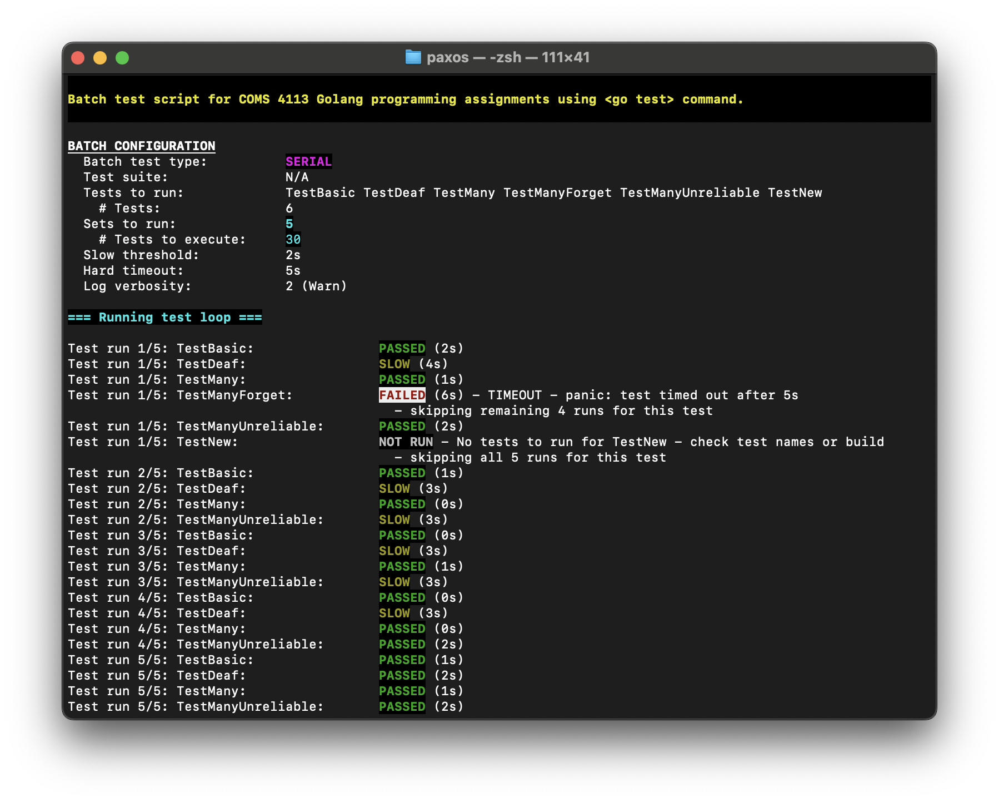
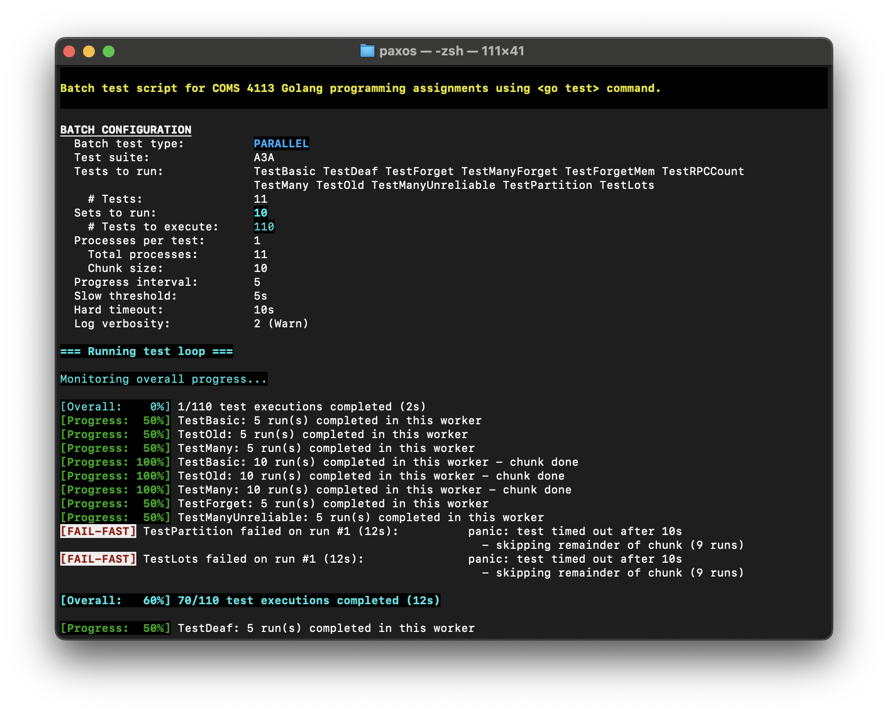

# COMS 4113: Batch Test Runner (`run_tests.sh`) - v1.06
Last edited: Nov 16, 2025  
Author: Wei Alexander Xin

This script is a comprehensive test runner for the Go programming assignments in COMS 4113. It wraps the standard `go test` command to streamline batch execution, providing choice of serial or parallel testing, detailed result aggregation with color-coding, and overall progress monitoring (handy!).

### UPDATE: V1.06 - Added a pre-flight build checker!  
Previously if your source code didn't build successfully, running this script would lead to either a confusing error followed by program exit, or the batch job begins but all runs fail noisily.  
Now the script checks to ensure source code is able to be built, prior to commencing batch job.  
If the build fails, build errors are captured and output to terminal, then the program terminates gracefully.

## 🌟 Features
- **Overall progress monitor:** In `PARALLEL` mode, a monitor now tracks all worker processes and prints the total batch progress (e.g., `[Overall: 10%] 500/5000 test executions completed (1m30s)`).
- **`slog` Integration:** The verbosity flags (`v`, `vv`, etc.) pass a `loglevel` flag to `go test`. This allows for fine control over logging from one command line.
- **Serial & Parallel modes:** Run tests sequentially for quick debugging (`SERIAL`) or in parallel across multiple processes for stress testing (`PARALLEL`).
- **Detailed results:** Individual test runs are labeled as **PASSED**, **SLOW** (passed but exceeded soft threshold), or **FAILED**.
  - FAILED test runs are further segmented into TIMEOUT due to hitting hard threshold or ERROR. 
  - For ERROR, the exact message per test run is printed to stdout.
  - In Parallel mode, chunks of test runs are shown as all PASSED, some SLOW, or some FAILED. FAILED runs are labeled individually.
- **Rich & readable output:** Color-coded, real-time logging and a final summary report.
- **Fail-Fast (for Timeouts):** TIMEOUT usually indicate a deadlock/livelock, so remaining runs for that specific test are canceled.
  - ERRORs are assumed to be non-deterministic, so the remaining runs for that test are allowed to proceed.
- **Test suites:** Pre-defined test suites for Assignments 3, 4, and 5 (e.g., `A4A`, `A4B`, `A5C_All`).
- **Flexible configuration:** Control the number of sets, parallel processes per set, soft/hard time thresholds, log verbosity, etc. via command-line flags.
- **Input sanitization:** Robust handling and sanity check of inputs and configuration parameters.
- **Pre-flight build checker:** Prior to running batch, captures build errors and outputs to terminal.
- **Detailed logging:** Creates `.log` files for all failed or slow runs, and `_summary.txt` files for parallel aggregation.

## 🚀 How to use

### 1. Placement
Download and place the `run_tests.sh` script in the directory containing the `go.mod` file and the `_test.go` files you want to run. Or, set the `go env` variables as per the Assignments:

```bash
$ export GO111MODULE=off
$ export GOPATH=$HOME/Documents/Classes/COMS_W4113
```

Note, for Assignment 5, you'll need to set `GO111MODULE=on`.

### 2. Permissions

Make the script executable:

```bash
chmod +x run_tests.sh
```

### 3. `slog` Setup (Required for `v` flags)

Presumably you are already using `slog` for logging because of how simple it is to set log level at runtime. If so, you may have already set up command line flags for this purpose. If not, here is a simple implementation.  
To use the log verbosity command line options for this script (`-v`, `-vv`, ...), simply add `slog` flag parsing to the `*_test.go` file(s). Otherwise the script will fail with a "flag provided but not defined" error.

Add this code to your `*_test.go` file(s) (e.g., `test_test.go`):

```go
import (
  "flag"
  "log/slog"
  "os"
)

// TestMain is run by <go test> before any actual tests
func TestMain(m *testing.M) {
  // Register loglevel flag with `flag` package, default 0 disables all `slog` messages
  logLevelFlag := flag.Int("loglevel", 0, "set debug log level (default 0: None, 1=Error, 2=Warn, 3=Info, 4=Debug")
  flag.Parse()

  // Set default to a `slog.Level` value higher than any defined log messages, meaning none would trigger
  logLevel := slog.LevelError + 1
  switch *logLevelFlag {
  case 1:
    logLevel = slog.LevelError
  case 2:
    logLevel = slog.LevelWarn
  case 3:
    logLevel = slog.LevelInfo
  case 4:
    logLevel = slog.LevelDebug
  }
  
  if *logLevelFlag > 0 {
    fmt.Printf("Logging enabled: global log level set to (%v).\n\n", logLevel)
  }
  // Alternative is NewTextHandler
  logger := slog.New(slog.NewJSONHandler(os.Stderr, &slog.HandlerOptions{
    Level: logLevel,
  }))
  // Use `slog` global default logger
  slog.SetDefault(logger)

  os.Exit(m.Run())
}
```

#### Sample log messages
Added in `.go` files:
```go
slog.Error("LOG - server.StartServer() - StartServer called:", "me", me)
slog.Warn("LOG - server.StartServer() - StartServer called:", "me", me)
slog.Info("LOG - server.StartServer() - StartServer called:", "me", me)
slog.Debug("LOG - server.StartServer() - StartServer called:", "me", me)
```

#### Examples (under the hood)
No logging (for production run, assignment hand-in), same as `go test -loglevel 0`, omit `-v` flag in test script:
> ```bash
> $ go test
> Test: Basic leave/join ...
> ...
> ```

`Error` level logging only, `-v` in test script:
> ```bash
> $ go test -loglevel 1
> {"time":"2025-11-16T13:55:48.92208-05:00","level":"ERROR","msg":"LOG - server.StartServer() - StartServer called:","me":0}
> Test: Basic leave/join ...
> ...
> ```

Everything `Debug` and below, `-vvvv` in test script:
> ```bash
> $ go test -loglevel 4
> {"time":"2025-11-16T13:46:51.627065-05:00","level":"ERROR","msg":"LOG - server.StartServer() - StartServer called:","me":0}
> {"time":"2025-11-16T13:46:51.627174-05:00","level":"WARN","msg":"LOG - server.StartServer() - StartServer called:","me":0}
> {"time":"2025-11-16T13:46:51.627176-05:00","level":"INFO","msg":"LOG - server.StartServer() - StartServer called:","me":0}
> {"time":"2025-11-16T13:46:51.627177-05:00","level":"DEBUG","msg":"LOG - server.StartServer() - StartServer called:","me":0}
> Test: Basic leave/join ...
> ...
> ```

Etc.  
Note that the above log lines would not appear in terminal output; they are captured and redirected to log files produced by this batch test script.

If you don't wish to use `slog` integration, just run the script without any `-v` flags -- or modify the script to integrate it with the custom logging system you've implemented!

### 4. Execution (quick launch)

**IMPORTANT:** You must be in the correct directory for the assignment part you want to test.

- **For A3a (paxos):** `cd src/paxos`
- **For A3b (kvpaxos):** `cd src/kvpaxos`
- **For A4a (shardmaster):** `cd src/shardmaster`
- **For A4b (shardkv):** `cd src/shardkv`
- **For A5 (paxos model checker):** `cd pkg` (or the root directory with `go.mod`)

Run the script. It will default to **SERIAL** mode, 100 runs, and all tests it is able to find.

```bash
# Run all tests 100 times in SERIAL mode
./run_tests.sh

# Run all tests 500 times in PARALLEL mode
./run_tests.sh -p

# Run only "TestBasic" 50 times in SERIAL mode with INFO logging
./run_tests.sh -vvv 50 TestBasic

# Run the A4B test suite 1000 times in PARALLEL mode
./run_tests.sh -p -z A4B 1000`
```

## 🖥️ Command-Line Interface - Advanced guide

### Usage

`Usage: ./run_tests.sh [options] [TOTAL_SETS] [TestName1] [TestName 2 ...]`

### Options

- `p`: Run in **PARALLEL** mode (default: `SERIAL`).
- `n NUM_PROCS`: (Parallel) Set number of parallel processes per test (default: 2).
- `g PROG_INT`: (Parallel) Set progress report interval *per worker* (default: 10).
- `z TESTSUITE`: Use a pre-defined test suite.
  - Supported test suites: A4A, A4B, A5A_State, A5A_Search, A5A_PP, A5A_All, A5B, A5C_Basic, A5C_Pred, 5C_All
- `v[v]...`: Set `slog` verbosity. Requires `slog` setup in your `_test.go` file.
    - `v`: Error
    - `vv`: Warn
    - `vvv`: Info
    - `vvvv`: Debug
- `s SLOW_TIME`: Set the "slow" threshold. Runs *passing* but exceeding this are "SLOW" (default: `1m`).
- `t TIMEOUT`: Set the hard timeout deadline. Runs exceeding this are "FAILED" (default: `2m`).
- `h`: Show the help menu.

### Positional arguments

- `TOTAL_SETS`: Number of times to run each test (default: 100 for Serial, 500 for Parallel).
- `TestName1...`: Specific test function names to run (default: all tests found).

## 📊 Interpreting the output

1. **Configuration:** The script first prints the configuration and all parameters for the batch job.
2. **Real-time test log:**
    - **Serial:** A line is printed for each test run (e.g., `Test run 1/100: TestBasic: ... PASSED (1s)`).
    - **Parallel:** A global `[Overall: ...]` monitor prints total progress. Individual worker progress and failures are also printed as they happen.
      - Global monitoring process reports on a 10s interval (poll) and/or every 10% (milestone). If no test runs were completed within a 10s interval, it snoozes up to 2 times before the next report.
      - Individual worker progress reporting intervals are determined by chunk size, which is calculated from batch configuration parameters.
3. **Final summary:** A report card for the entire batch.
    - `Total test executions`: The total number of individual `go test` runs.
    - `Not run`: Tests that couldn't be found (e.g., typo in test name). Very pesky one as it usually failed silently, but no more -- these are called out prominently.
    - `Passed`: Runs that passed cleanly and under the `SLOW_TIME` threshold.
    - `Slow`: Runs that *passed* but took longer than `SLOW_TIME`.
    - `Failed`: Runs that failed, errored, or hit the hard `TIMEOUT`.
    - `Skipped`: Runs skipped (in serial) or not completed (in parallel) after a `TIMEOUT` FAIL-FAST.
4. **File artifacts:**
    - `output_...log`: Detailed logs for any run that was **Failed** or **Slow**.
      - Passing logs are deleted to conserve disk space, especially important for large parallel batch testing jobs set to a high log verbosity level (we're talking gigabytes).
    - `unique_...txt`: Summary files showing which tests failed, were slow, passed fully, or not run at all.

## 🙏 Credits

- **Original script & colors idea:** Jessica Card (inspired!) 🥹
- **Parallelization:** Pranav Mantri (massive!) ✨
- **Contributions:** Ryan Sherby, Brian Paick, Anonymous 🤝
- **Special thanks:** Professor Geambasu and all CAs 🙇

---

## Screenshots

### Serial
In `src/paxos`, using artificially low soft and hard time thresholds to show the different result types.
```bash
$ ./run_tests.sh -vv -s 2s -t 5s 5 TestBasic TestDeaf TestMany TestManyForget TestManyUnreliable TestNew
```
  
  

### Parallel
In `src/paxos`, using artificially low soft and hard time thresholds to show the different result types. Selected test suite `A3A`.
```bash
$ ./run_tests.sh -p -n 1 -g 5 -z A3A -vv -s 5s -t 10s 10
```
  
  
  

